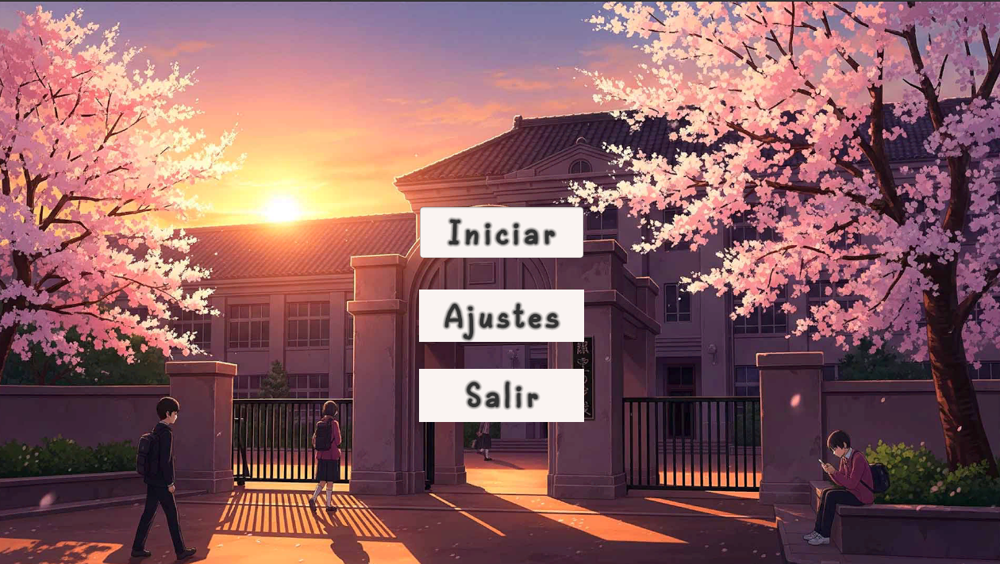
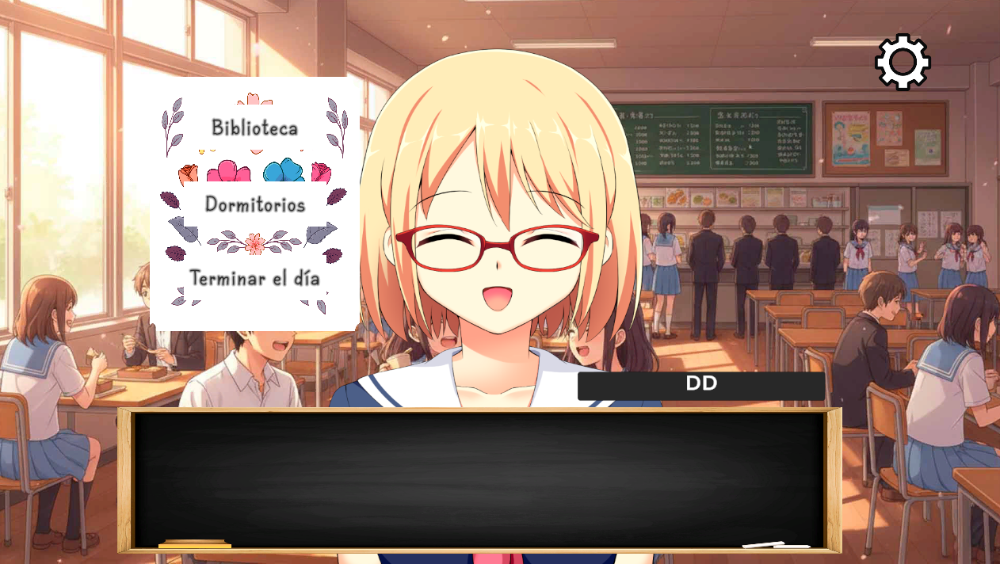
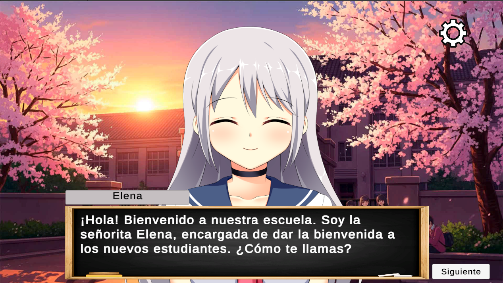

# VisualNovel2D_unity
This is a basic 2D visual novel application in unity.

# Novela Visual Anime – Proyecto Unity

> **Estado:** Prototipo funcional orientado a *visual novel* con arte estilo anime, tipado progresivo de texto, control centralizado de velocidad, transiciones entre escenas y verificación de progreso/jugabilidad.

---

## 📌 Tabla de contenidos
- [Características](#-características)
- [Arquitectura y scripts clave](#-arquitectura-y-scripts-clave)
- [Guía rápida (Getting Started)](#-guía-rápida-getting-started)
- [Agregar diálogos e imágenes paso a paso](#-agregar-diálogos-e-imágenes-paso-a-paso)
- [Control global de velocidad del texto (Slider)](#-control-global-de-velocidad-del-texto-slider)
- [Transiciones y navegación entre escenas](#-transiciones-y-navegación-entre-escenas)
- [Progreso y eventos (escenas logradas)](#-progreso-y-eventos-escenas-logradas)
- [Personalización del nombre del jugador](#-personalización-del-nombre-del-jugador)
- [Capturas y video demo](#-capturas-y-video-demo)
- [Estructura de carpetas recomendada](#-estructura-de-carpetas-recomendada)
- [Buenas prácticas y notas](#-buenas-prácticas-y-notas)
- [Roadmap / Ideas futuras](#-roadmap--ideas-futuras)
- [Requisitos y compilación](#-requisitos-y-compilación)
- [Licencia](#-licencia)

---

## ✨ Características
- **Texto progresivo tipo “máquina de escribir”** en múltiples *TextMeshProUGUI* al mismo tiempo.
- **Asignación sencilla de contenido**: agrega líneas de texto y **sprites** emparejados por índice para mostrar imágenes según el diálogo.
- **Control global de velocidad de aparición** con un **Slider** (0.1s = más lento, 0.01s = más rápido) que afecta a todos los componentes configurados.
- **Transiciones de escena suaves** con panel de transición y pequeñas demoras configurables.
- **Verificación de progreso/jugabilidad**: desactiva opciones o botones cuando una escena ya se visitó.
- **Opciones y finales**: activación de paneles de opciones y secciones finales cuando el bloque de texto termina.
- **Entrada del jugador**: captura y refleja el nombre del jugador en varios textos simultáneamente.

---

## 🧠 Arquitectura y scripts clave

> Los nombres de scripts referencian archivos del proyecto para que puedas ubicar la lógica rápidamente.

### `texto2.cs`
- Controla el **tipado progresivo** en una lista de `TextMeshProUGUI` (*varios cuadros pueden “escribir” a la vez*).
- Campos principales:
  - `textMeshPros`: destinos donde se imprime.
  - `images`: imágenes a sincronizar.
  - `textList`: **fuente de diálogo** (lista de líneas).  
  - `imageList`: **sprites** emparejados por índice con `textList`.
  - `letterAppearSpeed`: retardo entre letras (segundos).
  - `nextButton`: avanza el índice y alterna nombres `nombrePlayer / NombreNPC`.
  - `Opciones`, `CampoDeTexto`, `Final` y *animators* (`animadorOpciones`, `animadorDialogo2`, `animadorFinal`) para el flujo al finalizar.
- Comportamiento interesante:
  - Resetea el texto visible al cambiar de índice y **actualiza sprites** si existen.
  - Al finalizar el bloque: oculta `nextButton`, muestra `Opciones`, anima salida del cuadro de diálogo 2, y puede mostrar un **panel final**.

### `velocidadTexto.cs`
- Variante con animaciones de entrada/salida para UI (por ejemplo, mostrar un input o botón secundario al terminar).
- Expone `letterAppearSpeed` y el mismo patrón `textList` ↔ `imageList`.
- Activa/Desactiva animadores (`animador1`, `animador2`) con parámetros como **"salida"**, **"Entrada Input"** y **"Salida Input"**.

### `Texto2SpeedController.cs`
- Control central de la **velocidad de tipado** para **muchos** componentes (`texto2` y `velocidadTexto`) desde **un único Slider**.
- Mapea `Slider(0→1)` a `delay(0.1→0.01)` y lo aplica a todas las referencias (o las descubre automáticamente en escena).

### `RevisarEscenaLograda.cs`
- Detecta si escenas como **Cafetería / Biblioteca / Dormitorio** se **activaron al menos una vez** y desactiva después de un breve tiempo los botones de acceso correspondientes. Ideal para **progreso/bloqueos**.

### `Cafeteria.cs`
- Demuestra un **cambio de escena** con panel de transición. En `CambiarEscena()` dispara una *coroutine* que:
  1) Muestra `panelTransición`  
  2) Espera 1s (configurable)  
  3) Oculta panel, desactiva escena actual y activa la nueva

### `nombre.cs`
- Copia el texto de un `TMP_InputField` a múltiples `TextMeshProUGUI`, para reflejar el **nombre del jugador** donde sea necesario.

---

## 🚀 Guía rápida (Getting Started)

1. **Clona/Importa** el proyecto en Unity *(recomendado 2021.3 LTS o superior)*.
2. Abre la **escena inicial** y presiona *Play*.
3. Usa el **botón Next** para avanzar diálogos; observa cómo cambian los **sprites** asociados.
4. Ajusta el **Slider** para cambiar la velocidad del tipado global.
5. Navega entre escenas (menú → cafetería/biblioteca/dormitorio) y verifica cómo se **ocultan** botones cuando una escena ya fue visitada.

---

## ✍️ Agregar diálogos e imágenes paso a paso

1. En tu objeto que tenga `texto2` (o `velocidadTexto`), abre el **Inspector**.
2. Completa **`textList`** con las líneas del diálogo **en orden**.
3. (Opcional) Asigna **`imageList`** con sprites del mismo tamaño/lógica; el **índice** coincide con `textList`.
4. Rellena **`textMeshPros`** con los campos de destino (uno o más *TextMeshProUGUI*).
5. (Opcional) Rellena **`images`** con *Image* donde quieras mostrar la ilustración ligada al texto.
6. Asigna el **`nextButton`** y (si aplica) animadores/paneles (Opciones, CampoDeTexto, Final).
7. ¡Listo! El tipado progresivo iniciará en *Start*, y con **Next** avanzas el índice.

> **Tip:** si alternas entre `nombrePlayer` y `NombreNPC`, el script cambia la visibilidad para resaltar quién habla.

---

## 🎚️ Control global de velocidad del texto (Slider)

1. Crear un `GameObject` (ej. **TextoSpeedManager**) y agregar `Texto2SpeedController`.
2. Asignar el **`Slider`** (Min=0, Max=1).  
3. Arrastrar a las listas **todos** los componentes `texto2` y `velocidadTexto` que deban responder a ese slider, o activar el **descubrimiento automático**.
4. Al mover el `Slider`, el proyecto ajusta `letterAppearSpeed` en todos los objetivos:
   - `0` → **lento** (0.1 s por letra)  
   - `1` → **rápido** (0.01 s por letra)

> Puedes invertir el sentido cambiando el `Lerp` a `Lerp(fastDelay, slowDelay, t)`.  

---

## 🎭 Transiciones y navegación entre escenas

- Usa `Cafeteria.CambiarEscena()` como **patrón**:
  - Muestra un **panel de transición** (ideal para *fade in/out* con animador o *CanvasGroup*).
  - Tras una breve espera, desactiva la escena actual y activa la nueva.
- Recomendación: abstrae esta lógica a un **SceneTransitionManager** si necesitas más efectos (curvas, sonidos, bloqueo de input).

---

## 🧩 Progreso y eventos (escenas logradas)

- `RevisarEscenaLograda` **monitorea** si ciertas escenas (`EscenaCafetería`, `EscenaBiblioteca`, `EscenaDormitorio`) estuvieron **activas**:
  - La primera vez que detecta `activeSelf == true`, agenda desactivar el botón correspondiente después de un retraso.
- Útil para:
  - **Bloquear reentradas**.
  - Mostrar **rutas** ya visitadas.
  - Desencadenar **siguientes capítulos** u opciones nuevas.

> Extensión: persiste *flags* de progreso (PlayerPrefs/JSON/ScriptableObject) para recordar el avance entre sesiones.

---

## 🧑‍🎓 Personalización del nombre del jugador

- `nombre.cs` copia el contenido de un `TMP_InputField` a varios `TextMeshProUGUI` con un botón.
- Útil para **presentación** y para mostrar el nombre del jugador en globos de diálogo, menús y escenas.

---

## 🖼️ Capturas y video demo

### Menú principal

### Captura 1

### Captura 2

### Video (YouTube)
▶ Ver demo en YouTube 
> `

---

---

